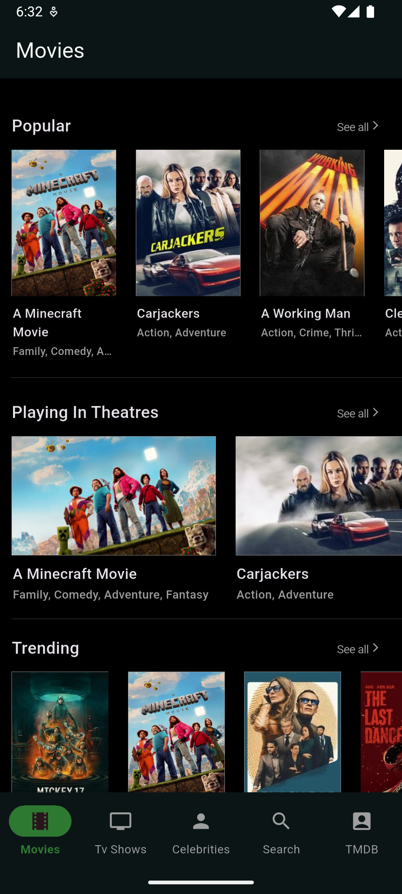
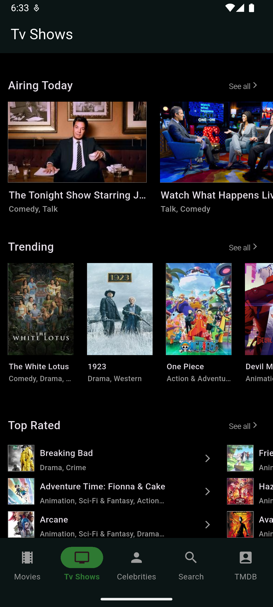
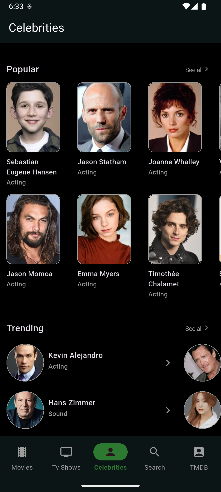
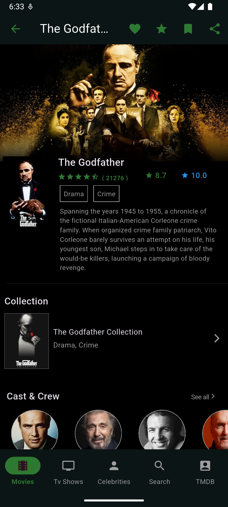
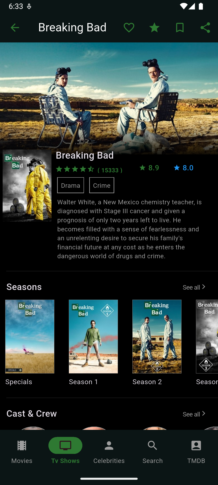
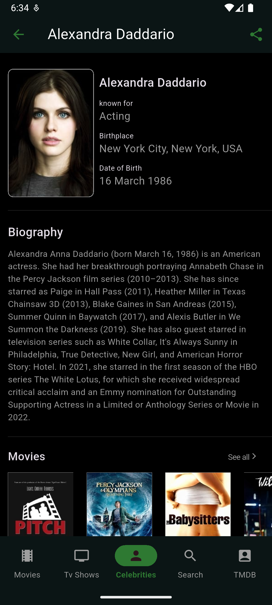
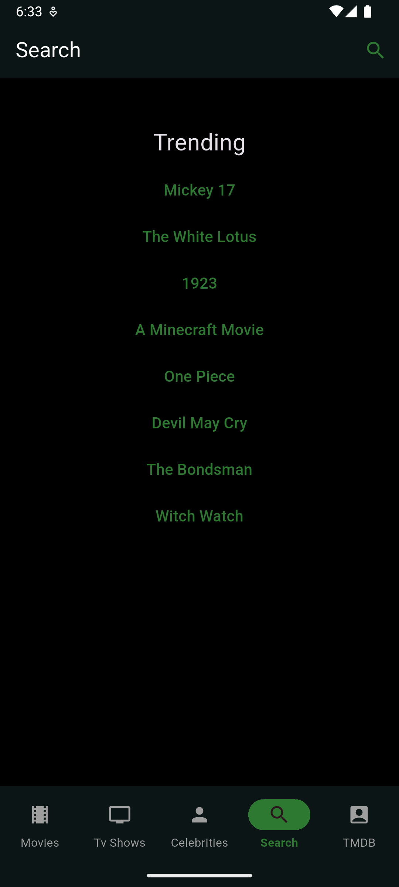
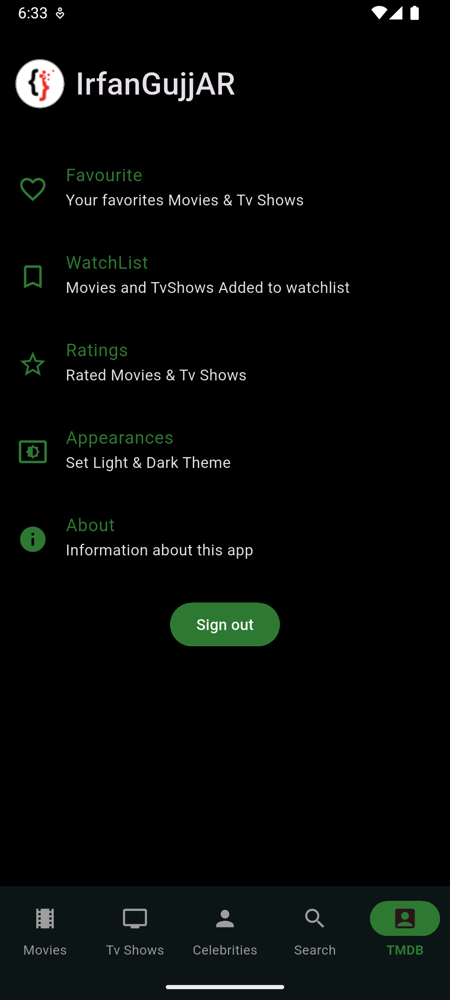

# TMDb App

TMDb is a native Android application developed using Kotlin that uses the https://www.themoviedb.org
API to retrieve information on movies, TV shows, celebrities, and more.

I have also developed this app using the Flutter framework: https://github.com/IRFAN-GujjAR/tmdb

***Playstore Link***: https://play.google.com/store/apps/details?id=com.irfangujjar.tmdb&hl=en

***Code Structure***
- Clean Architecture

***UI***
- Jetpack Compose for UI

***Network Requests***
- Retrofit Library for API requests

***Cache***
- The room library is used for caching data on Movies, TV Shows, Celebrities, Search, and TMDb pages.

***Navigation***
- Navigation 3 library for navigation

**App ScreenShots**

&nbsp;&nbsp;&nbsp;&nbsp;&nbsp;&nbsp;&nbsp;&nbsp;&nbsp;&nbsp;&nbsp;&nbsp;

&nbsp;&nbsp;&nbsp;&nbsp;&nbsp;&nbsp;&nbsp;&nbsp;&nbsp;&nbsp;&nbsp;&nbsp;

&nbsp;&nbsp;&nbsp;&nbsp;&nbsp;&nbsp;

# License

Copyright (c) 2025 Muhammad Irfan Ali

http://www.apache.org/licenses/LICENSE-2.0

Besides the above notice, the following license applies, and this license notice must be included in
all works derived from this project.

**You are not allowed to publish this app on Appstore or Playstore.**

The above copyright notice and this permission notice shall be included in all copies or substantial
portions of the Software.

THE SOFTWARE IS PROVIDED "AS IS", WITHOUT WARRANTY OF ANY KIND, EXPRESS OR IMPLIED, INCLUDING BUT
NOT LIMITED TO THE WARRANTIES OF MERCHANTABILITY, FITNESS FOR A PARTICULAR PURPOSE, AND
NONINFRINGEMENT. IN NO EVENT SHALL THE AUTHORS OR COPYRIGHT HOLDERS BE LIABLE FOR ANY CLAIM, DAMAGES
OR OTHER LIABILITY, WHETHER IN AN ACTION OF CONTRACT, TORT OR OTHERWISE, ARISING FROM, OUT OF OR IN
CONNECTION WITH THE SOFTWARE OR THE USE OR OTHER DEALINGS IN THE SOFTWARE.
